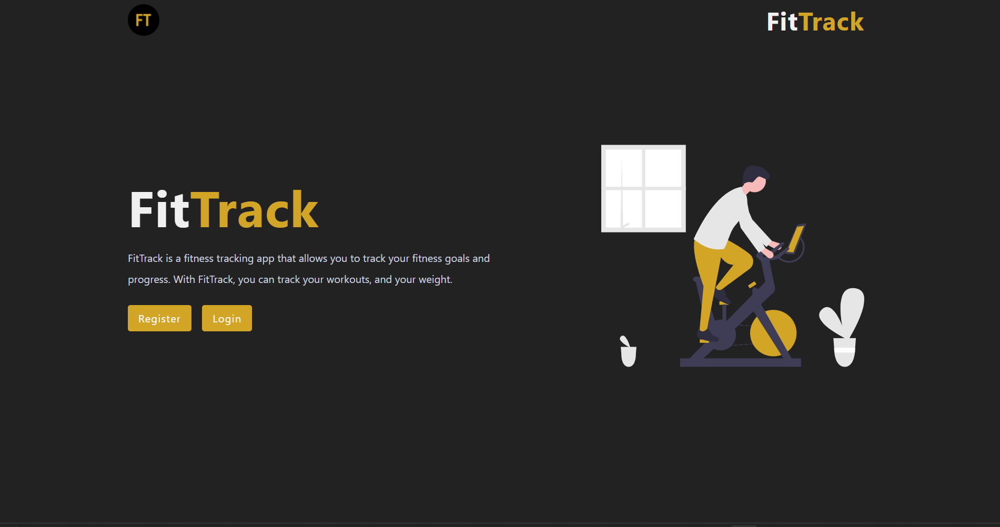
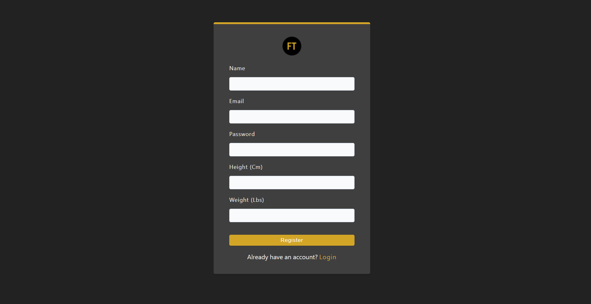
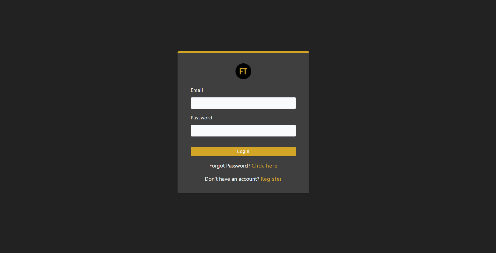

# FitTrack

Welcome to the FitTrack, a user-friendly application designed to help you achieve your fitness goals by allowing you to create exercises, track your weight, and visualize your progress with interactive graphs. Whether you're a seasoned athlete or just starting your fitness journey, this app will help you stay on track and motivated.

## Table of Contents

1. [Introduction](#introduction)
2. [Features](#features)
3. [Getting Started](#getting-started)
4. [How to Use](#how-to-use)
5. [Screenshots](#screenshots)

## 1. Introduction

FitTrack is a powerful tool that enables users to:

- **Create Exercises:** Easily add and manage your exercises, complete with details like exercise name, sets, reps and weight.
- **Track Weight:** Keep a record of your weight changes over time, helping you monitor your progress.
- **Visualize Progress:** View interactive graphs of your weight changes, making it easier to identify trends and patterns.

Whether you're trying to build muscle, lose weight, or simply maintain a healthy lifestyle, this app will help you on your journey.

## 2. Features

- **Exercise Management:** Create, edit, and delete exercises to build your custom workout routines.
- **Weight Tracking:** Log your weight on a daily, weekly, or monthly basis.
- **Graphical Visualization:** Interactive graphs help you visualize your weight changes over time.
- **User Profiles:** Create and manage your user profile.
- **Responsive Design:** The app is designed to work on both desktop and mobile devices.

## 3. Getting Started

To get started with the Fitness Tracker App, follow these steps:

1. **Clone the Repository:** Download or clone the repository to your local machine.
2. **Install Dependencies:** Run the command `npm run setup-production-app` from the root directory. Then, go to client directory and copy the contents inside the dists folder into the public folder from the root directory.
3. **Configuration:** Set up the app's configuration, such as database connections and user authentication, in a .env file. The format of the .env are outlined in the env.txt file
4. **Run the App:** Start the app by running `node server` from the root directory. The app will be accessible at `http://localhost:5000` by default.

P.S. The application will eventually be deployed on the web.

## 4. How to Use

1. **Manage Exercises:**

   - Log in to your account or create a new one.
   - Navigate to the "Exercises" section to view all exercises.
   - Use the Search bar to search Exercises by name.
   - Click on an Exercise to update or delete it.
   - Click on the "Add Exercise" button to create a new exercise.
   - Fill in exercise details, including name, sets, reps and weight.
   - Save the exercise.

2. **Track Weight:**

   - Go to the "Weight Tracker" section.
   - Enter your current weight and the date.
   - Click on the "Submit" button.

3. **Visualize Progress:**
   - View your weight change graph and select ranges to view certain time periods.
   - The graph will show your weight changes over time, making it easy to monitor your progress.

## 5. Screenshots

More will be added later.
